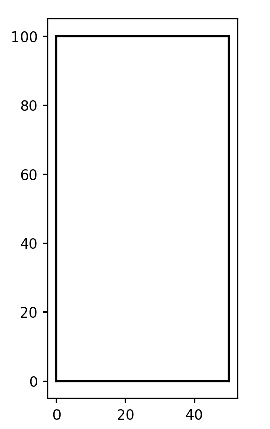
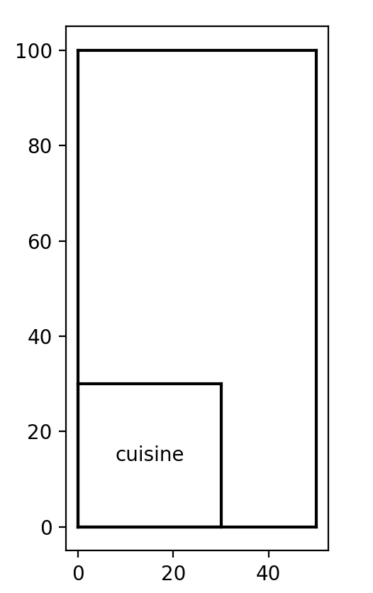

# HDA lang

_HDA lang_ est un language permetant la réalisation de plan de maison à partir d'un texte ou d'un mode interactif.

## Mode _texte_

Pour utiliser le mode texte, il faut dans un premier temps un texte.

_Exemple:_

```txt
J'aimerai un plan de maison avec un étage de 50m sur 100m, il y a une pièce: la cuisine de 30m sur 30m. 
Il y a le salon de 15m sur 15m a droite de la cuisine, le garage de 20m sur 20m est au-dessus de la cuisine. Il y a un second étage de 50m sur 50m, avec une pièce, 
la chambre de 25m sur 50m, la salle de bain fait 15m sur 20m et elle est a droite de la chambre ;
```

Pour que cela fonctione il est important de respeter une certaine gramaire:

1. Commencer par un étage poursuivis de s'est dimension.
2. Poursuivre par les pièces suivis de leurs dimension.
3. Si vous-devez positionner les pièces il faut donner un mot clé de position après les dimensions, et il faut évidement dire à coté de qu'elle pièce elle se situe.
4. Il est important de terminer par le caractère `;` pour marquer la fin de la maison.

On peut ensuite éxectuter le code avec: 

```bash
python hda.py -b sample.hda
```

Ce qui permet d'obtenir les figures suivantes


## Mode _interactif_

Le mode _interactif_ est un mode console, il faut dans un premier temps éxectuer le code:

```bash
python hda.py -i
```

Ce qui va nous permettre d'entrer le plan de notre maison en plusieurs étapes et de voir toute les modifications:

```txt 
>>> J'aimerai un plan de maison avec un étage de 50m sur 100m
>>> il y a une pièce: la cuisine de 30m sur 30m
>>> Il y a le salon de 15m sur 15m a droite de la cuisine
>>> le garage de 20m sur 20m est au-dessus de la cuisine
>>> Il y a un second étage de 50m sur 50m
>>> exit
```

<p align="center">
  
  
</p>

## Lexique 

1. __étage:__  étage/floor, etage, etages, étages/floors 
2. __pièce:__  cuisine/kitchen, garage, salon/lounge, chambre/bedroom, salle de bain/bathroom
3. __position:__ droite/right, gauche/left, au-dessus/top, au-dessous/bottom
